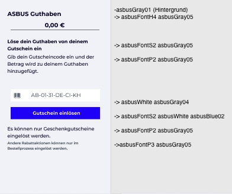

# Asbus_Aufgaben
## Aufgabe 01 

#### Hinweise zur implementierung: 
- Das Eingabefeld in der Mitte ist ein UITextField mit placeholder AB-01-31-DE-CI-KH
- Gutschein Einloesen ist ein UIButton dazu kann die Funktion styleBlueButton() hilfreich sein (definiert in Utility).
- Alles andere sind UILabels
- Links und rechts gilt ein Abstand von .horizontalSpacing (definiert in Utility).
- Farben und Fonts sollten die in Utility definierten verwendet werden. 

